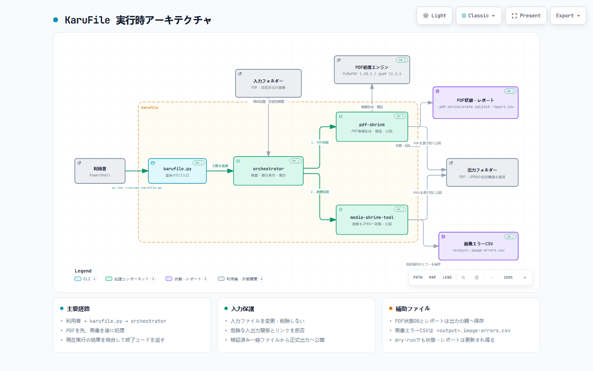

# KaruFile

KaruFileは、フォルダー内のPDFと画像を、入力原本を変更・削除せず別フォルダーへ
一括で軽量化するWindows向けCLIです。

## 利用者向け正本

初回準備、安全上の注意、実行手順、出力場所、変換条件、終了コードは
[KaruFile 利用者マニュアル](MANUAL.md)を参照してください。このREADMEは入口です。

数値、status、再利用条件、個別CLIは [KaruFile技術リファレンス](docs/REFERENCE.md)で
検索できます。

処理全体は、Archifyで生成・検証した図から先に確認できます。

[](docs/architecture/karufile-runtime.html)

- [対話型HTMLを開く](docs/architecture/karufile-runtime.html)
- [図の検証済みJSONを確認する](docs/architecture/karufile-runtime.architecture.json)

## 最短の実行手順

必要環境はWindows、Python 3.13以上、[uv](https://docs.astral.sh/uv/)です。

```powershell
uv sync --project pdf-shrink --dev
uv sync --project media-shrink-tool
uv run --script karufile.py --dry-run -i "D:\作業\資料" -o "D:\作業\資料_軽量化"
uv run --script karufile.py -i "D:\作業\資料" -o "D:\作業\資料_軽量化"
```

`-o` を省略すると、入力と同じ階層の `<入力フォルダー名>_軽量化` を使います。
入力と出力が同一、または互いに親子となる指定は処理前に拒否します。

> `--dry-run` でも状態DBとレポートは更新される場合があります。画像のメタデータは
> 削除を保証せず、GPS情報が残る場合があります。実行前に正本マニュアルを確認してください。

## 構成

| パス | 役割 |
|---|---|
| `karufile.py` | 通常使うCLI入口 |
| `orchestrator/` | PDFと画像の処理コンポーネントを順に呼び、結果を集計 |
| `pdf-shrink/` | PDF処理の正本。PyMuPDF、qpdf、SQLiteを使用 |
| `media-shrink-tool/` | 画像をJPEGへ変換する処理コンポーネント |

コンポーネント固有のCLIと内部契約:

- [pdf-shrink](pdf-shrink/README.md)
- [media-shrink-tool](media-shrink-tool/README.md)
- [orchestrator](orchestrator/README.md)

文書の正本・補足・履歴の区別は [文書ガイド](docs/README.md)、AI向けのリポジトリ指示は
[AGENTS.md](AGENTS.md)、実装計画と検証記録は [ExecPlan索引](.agent/execplans/README.md) にあります。

## 開発検証

```powershell
uv run --project pdf-shrink python -m pytest -q pdf-shrink/tests
uv run --project media-shrink-tool --extra dev python -m pytest -q media-shrink-tool/tests
Push-Location orchestrator
uv run --with pytest python -m pytest -q
Pop-Location
uv run --script karufile.py --help
```

自動テストは小さな合成データが中心です。今回の実装では実データPilotを実施していません。
