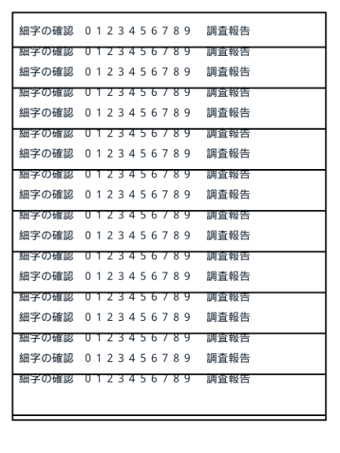
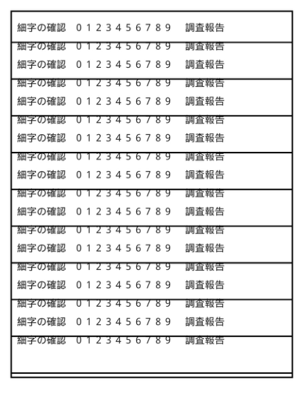
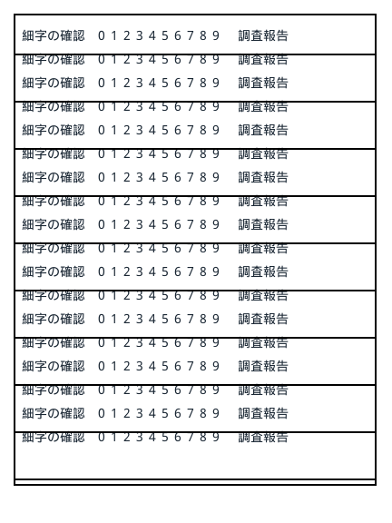
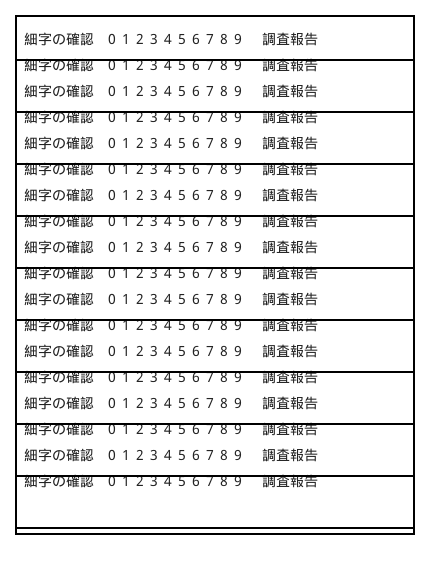

# PDF原本保護・文章向け候補の検証

実装・自動検証・実資料Pilotは完了。比較HTMLのブラウザー目視は未完了です。
ローカルfile URLへのアクセスがブラウザーツールのURL安全ポリシーで拒否され、回避操作はしていません。
既存の写真比較に対する過去のブラウザー確認を、今回のHTML表示確認として流用しません。

## 実装

- standard/compact共通で、未許可の図・画像PDFを候補生成前に原本コピー。
- preserveを最優先し、text/text-scan/photoの重複許可を処理前に拒否。
- 文字のみ自動許可、単純罫線表と文章スキャンを明示許可。検査失敗はERRORとして原本復旧。
- 文章向けはqpdf・subset・gray、スキャンは300 DPIグレーJPEG品質92/85/80を独立比較。
  文字・配置・リンク・しおり・metadata・描画を検証し、原本より小さい最小候補だけ採用。
- schema 5の追加DB移行、要求policy・分類・許可根拠・保護理由、原本SHA照合を統合。
- 比較対象を全PDFへ拡張し、保護対象は追加候補を生成しない。文書と構成図を同期。

## 自動検証

リポジトリ直下から実行。orchestratorだけはそのディレクトリへ移動しました。

| コマンド | 結果 |
|---|---|
| `uv run --project pdf-shrink python -m pytest -q pdf-shrink/tests --tb=short` | 330 passed、26.30秒 |
| `uv run --project media-shrink-tool --extra dev python -m pytest -q media-shrink-tool/tests` | 64 passed |
| `uv run --project video-shrink python -m pytest -q video-shrink/tests` | 104 passed |
| `uv run --with pytest python -m pytest -q --tb=short`（orchestrator内） | 244 passed |
| `uv run --project pdf-shrink python -m compileall -q pdf-shrink/src pdf-shrink/tests` | exit 0 |
| `uv run --project media-shrink-tool python -m compileall -q media-shrink-tool/src media-shrink-tool/tests` | exit 0 |
| `uv run --project video-shrink python -m compileall -q video-shrink/src video-shrink/tests` | exit 0 |
| `uv run --project pdf-shrink python -m compileall -q karufile.py orchestrator` | exit 0 |
| `uv run --script karufile.py --help` | exit 0、新オプション表示 |
| `uv run --project pdf-shrink pdf-shrink run --help` | exit 0、新オプション表示 |
| `uv build --project pdf-shrink --out-dir <新規検証フォルダー>/wheel` | sdist/wheel生成成功 |
| `git diff --check` | exit 0 |

合計742 passed。最初のPDF実行ではjpegtran未指定による4件skipがありましたが、最後は
`KARUFILE_TEST_JPEGTRAN`に既存の手動準備済み3.2.0を指定し、全330件を実行しました。
使用前に実行ファイルSHA-256 `671166b760a6b0e6b9888ce471fcb97c2a245db07512cd75c23ee29148d0acd0`を照合。
ダウンロード・インストールは行っていません。

新規合成テストは、保護時候補呼出しゼロ、競合、特殊画像、共有配置、低DPI、罫線と曲線・塗り・斜線、
構造障害、1 byte削減、増大、同サイズ、グレー棄却、OCR・文字位置・リンク・しおり・metadata、
ツール障害、時間・pixel・ページ・stream上限、safe/dry-run、旧CSV拒否・保護報告改ざんを含みます。
既存のDB追加移行・再開・preview変更時の成功出力再利用・原子的公開の試験も成功しています。

wheel内の`preview.html`・`policy.py`・`text_optimize.py`が現在のソースとバイト一致することを確認。
比較HTMLは埋込みJSONを別途parseし、実行scriptを`node --check`で検査しました。
初回の検証scriptはJSONデータまでJavaScriptとして扱って失敗したため、実行scriptと分離して再検査しています。

## 実資料と合成資料

再現script: [verify_text_policy.py](../../pdf-shrink/experiments/verify_text_policy.py)。
既存フォルダーを出力先に指定すると拒否します。今回の保存先:

```text
C:\Users\tn\Downloads\KaruFile_文章保護検証_20260909_01
C:\Users\tn\Downloads\KaruFile_文章保護検証_20260909_02
```

各フォルダーの`summary.json`・`runs.json`・`before.json`・`after.json`と各実行のstdout/stderrを保持。
初回は原本・既存検証出力等1,059ファイル、最終実行は原本・前回比較出力・初回出力等640ファイルで
それぞれSHA-256不変を確認しました。初回の後で採用理由とdry-run予定modeを修正し、最終実行で再検証。
入力原本・既存完成出力を削除・上書きしていません。

実資料5冊はstandard/compactとも、無指定では全冊`PRESERVED_ORIGINAL`、候補履歴`[]`、出力SHA一致。
`--pdf-photo-pattern "2.*.pdf" --pdf-photo-pattern "5.*.pdf" --pdf-photo-dpi 150`では、
許可した2冊だけ`ADOPTED_LOSSY`になり、残り3冊は原本保護でした。

| 資料 | 原本bytes | 写真2冊指定時の出力bytes |
|---|---:|---:|
| 1.現地調査報告書 | 340536 | 340536 |
| 2.現地写真 | 3556324 | 1588343 |
| 3.試料採取箇所 | 588304 | 588304 |
| 4.分析報告書 | 1517266 | 1517266 |
| 5.採取写真 | 2539782 | 1228846 |

| 日本語合成資料 | 原本bytes | 採用bytes | 採用候補 |
|---|---:|---:|---|
| 文字 | 5022 | 1043 | text_gray |
| 罫線表 | 6182 | 1128 | text_gray |
| 300 DPIスキャン | 3243572 | 130363 | text_scan_jpeg_80 |
| 600 DPIスキャン | 12963575 | 123701 | text_scan_jpeg_80 |

文字・罫線表のグレー候補は72/300 DPI完全一致を通過。スキャン候補は既存の全体5%・局所20%基準を維持。
300 DPI画像は原寸、600 DPI画像は300 DPIへ縮小しました。罫線と文字が接する箇所を含む合成原本であり、
実資料の文章スキャンに対する削減率・可読性やOCR精度を検証済みとはしません。

最終実行の[候補履歴・SHA・コマンド](2026-09-09-text-policy/pilot-evidence.json)を保存しています。

## 表示資料

合成資料と明示保護資料で、各6 viewの画像参照と原本／出力の同寸法、HTMLの構文、外部通信コードなしを確認。
保護側は全4冊で原本・実出力の2 variantだけとなり、150 DPI追加指定による迂回生成はありません。
dry-runは完成PDF・PNG・HTMLを生成せず、要求manifestを記録しました。

生成PNGの目視確認例（左が原本、右が実出力）:

| 600 DPI入力スキャン | 300 DPI・品質80採用出力 |
|---|---|
|  |  |

| 罫線表原本 | グレー採用出力 |
|---|---|
|  |  |

これは比較HTMLのブラウザー表示・操作確認を代替する証拠ではありません。
未完了の確認先は最終検証フォルダーの`synthetic/pdf-preview/20260908T235159Z-c38fcb15ea4b/index.html`と
`protected-preview/pdf-preview/20260908T235201Z-1044860fc325/index.html`です。
ブラウザーで資料・ページ・倍率切替、画像ロード、保護理由、左右スクロール連動を確認する必要があります。

構成図はArchifyでvalidate/deliver後にvisual-checkを実行し、showcase 9/9、errors 0、warnings 0。
1440×900、1600×1000、1920×1080、2048×1320で縦横overflowなし。
最小／最大viewportのlight/dark計4スクリーンショットを目視確認しました。
[delivery receipt](2026-09-09-text-policy/architecture-delivery.json)のHTML SHA-256は
`bb8abc56605acb18090d6841a3b22796462b8f7037302346b00c6c1331987d70`。
機械生成receiptの`visualReview: pending`を手動で書き換えず、この文書を目視確認の記録とします。

作業中に別経路でHEADが`9469ce7`、`3f7a6b2`へ進み、一部の実装が履歴に含まれました。
このagentはcommit/pushを実行していません。構成図は生成時の基準revision `9469ce72d0679880c60f8d5b106e49eca64789de`を保持し、
未commit差分を含む表示であることを図中に明記しています。
